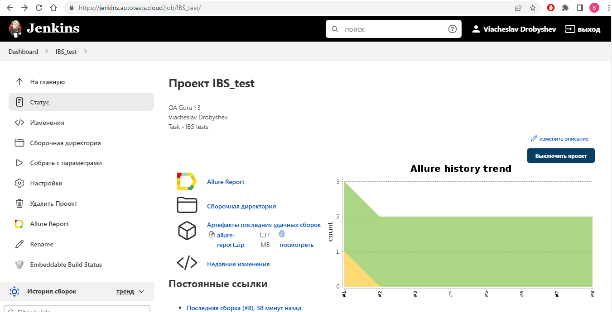
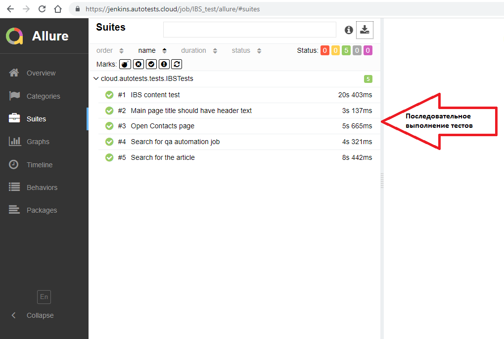
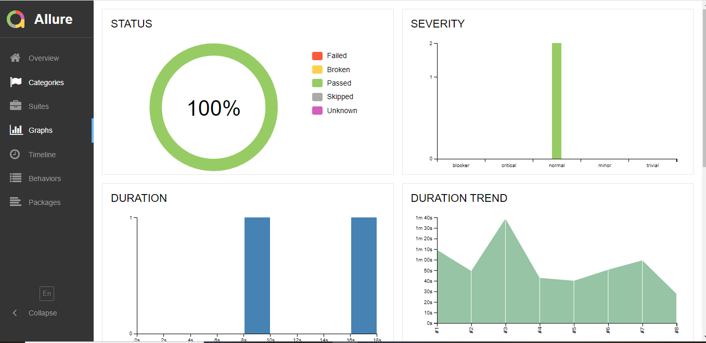
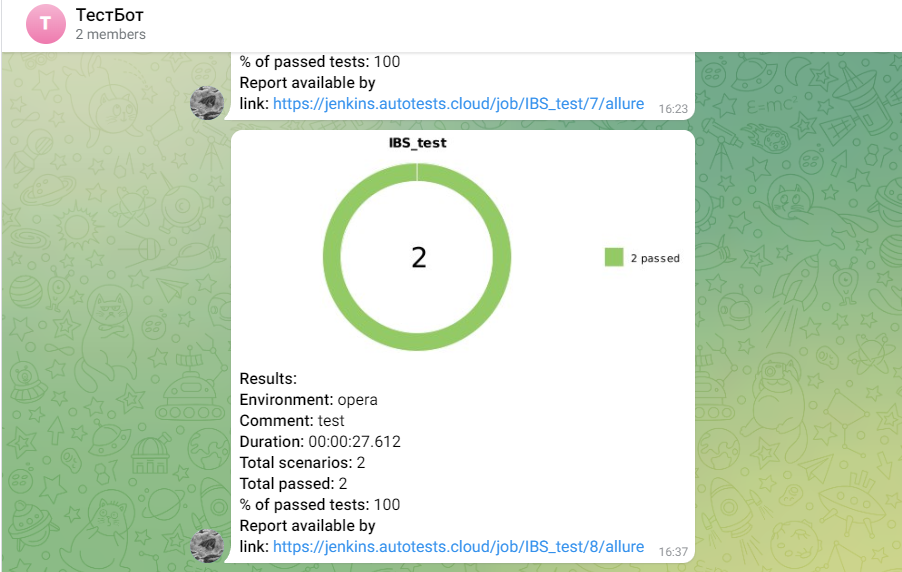

# Проект по автоматизации IBS


## 🚀: Содержание:

> ➠ [Технологии и инструменты](#earth_africa-технологии-и-инструменты)
>
> ➠ [Реализованные проверки](#earth_africa-Реализованные-проверки)
>
> ➠ [Сборка в Jenkins](#earth_africa-Jenkins-job)
>
> ➠ [Запуск из терминала](#earth_africa-Запуск-тестов-из-терминала)
>
> ➠ [Примеры использования](#earth_africa-Allure-отчет)
>
> ➠ [Allure отчет](#earth_africa-Allure-отчет)
>
> ➠ [Отчет в Telegram](#earth_africa-Уведомление-в-Telegram-при-помощи-бота)
>
> ➠ [Видео примеры прохождения тестов](#earth_africa-Примеры-видео-о-прохождении-тестов)

  
## 🧰: Технологии и инструменты

<p align="center">
<a href="https://www.jetbrains.com/idea/"></a>
<a href="https://www.java.com/"></a>
<a href="https://github.com/"></a>
<a href="https://junit.org/junit5/"></a>
<a href="https://gradle.org/"></a>
<a href="https://selenide.org/"></a>
<a href="https://aerokube.com/selenoid/"></a>
<a href="https://github.com/allure-framework/allure2"></a>
<a href="https://www.jenkins.io/"></a>
</p>

## ⚓: Реализованные проверки

## 🌀: Тест прогон 1
- ✓ Открыть сайт ibs.ru 
- ✓ Нажать на кнопку "Принимаю условия" (cookie)
- ✓ Сменить язык содержимого сайта на английский (ENG)
- ✓ Перейти в раздел Technology Partners
- ✓ Расширить список отображаемых партнеров, нажав на кнопку SHOW
- ✓ Проверить что среди отображаемых партнеров есть ROBIN Partner

## 🌀: Тест прогон 2
- ✓ Выполнить поиск компании IBS
- ✓ Проверить что в названии присутствует текст "IBS — ведущая российская IT-сервисная компания"

## 🌀: Тест прогон 3
- ✓ Открыть сайт ibs.ru
- ✓ Зайти в раздел "Контакты"
- ✓ Кликнуть по адресу главного офиса
- ✓ Проверить что гланый офис находится по адресу Москва, Дмитровское шоссе,9Б

## 🌀: Тест прогон 4
- ✓ Открыть сайт ibs.ru
- ✓ Ввести в поиск "Инженер по автоматизации тестирования Java" 
- ✓ Открыть найденную вакансию
- ✓ Проверить что с таким названием содержится одна вакансия

## 🚴: Тест прогон 5
- ✓ Открыть сайт ibs.ru
- ✓ Кликнуть на раздел "Меню"
- ✓ Перейти в раздел IT-инфраструктура
- ✓ Проверить что на странице содержиться статья про "Промышленный интернет вещей"
- ✓ Перейти в данную статью
- ✓ Проверить что на странице содержится форма "Запросить контакты или подробности"

## </a> Jenkins <a target="_blank" href="https://jenkins.autotests.cloud/job/IBS_test/"> job </a>
<p align="center">
<a href="https://jenkins.autotests.cloud/job/IBS_test/"></a>
</p>


## 🧙: Параметры сборки в Jenkins:

- Browser (браузер, по умолчанию chrome)
- Version (версия браузера, по умолчанию 91.0)
- Browser_size (размер окна браузера, по умолчанию 1920x1080)


## 🏗️: Запуск тестов из терминала
Локальный запуск:
```
gradle clean test
```

Удаленный запуск:
```
clean
test
-Dbrowser=${BROWSER}
-Dversion=${VERSION}
-Dsize=${BROWSER_SIZE}
-Durl=${REMOTE_URL}
```

# Примеры использования

### Для запуска удаленных тестов необходимо заполнить remote.properties или передать значение:

* browser (default chrome)
* browserVersion (default 89.0)
* browserSize (default 1920x1080)
* browserMobileView (mobile device name, for example iPhone X)
* remoteDriverUrl (url address from selenoid or grid)
* videoStorage (url address where you should get video)
* threads (number of threads)


Запускайте тесты с заполненным remote.properties:
```bash
gradle clean test
```

Запускайте тесты с незаполненным remote.properties:
```bash
gradle clean -DremoteDriverUrl=https://%s:%s@selenoid.autotests.cloud/wd/hub/ -DvideoStorage=https://selenoid.autotests.cloud/video/ -Dthreads=1 test
```

Выдать отчет:
```bash
allure serve build/allure-results
```
## </a> Отчет в <a target="_blank" href="https://jenkins.autotests.cloud/job/IBS_test/allure/">Allure report</a>

## ⛅: Основной отчет
<p align="center">

</p>
C:\Users\maver\IBS-tests\images\screens\report.PNG

## 🧪: Тесты
<p align="center">

</p>
https://selenoid.autotests.cloud/video/1c3aeafdd0e50cdb8a04321ea7b3af5d.mp4
## 💹: Графики
<p align="center">

</p>

## </a> Уведомление в Telegram при помощи бота

<p align="center">

</p>

## ⬇️: Примеры запуска тестов в Selenoid
## </a> Видео <a target="_blank" href="https://selenoid.autotests.cloud/video/fe43b9f89a795109ff4959044e6650d7.mp4">прохождения тестов </a>
<p align="center">
<a href="https://selenoid.autotests.cloud/video/fe43b9f89a795109ff4959044e6650d7.mp4"></a>
</p>

